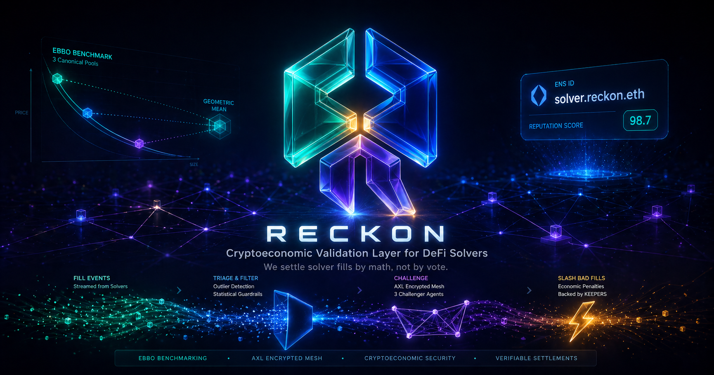

<p align="center">
  
</p>

<h1 align="center">Reckon</h1>
<p align="center"><i>Cryptoeconomic Validation Layer for DeFi Solvers</i></p>

<p align="center">
  Reckon makes every DeFi solver fill cryptographically challengeable, with automatic slashing on objective EBBO violations &mdash; no DAO vote required. Solvers register as ENS subnames under <code>solvers.reckon.eth</code> and post bonds proportional to their on-chain reputation. Challenger agents &mdash; minted as iNFTs (ERC-7857) on 0G Galileo with persistent memory on 0G Storage &mdash; monitor fills via an off-chain indexer, compute an equal-weighted geometric-mean benchmark from 3 canonical Uniswap pools, and auto-submit challenges when a fill breaches the swapper's tolerance. Slashing is immediate: 60% restitution to the swapper, 30% to the iNFT owner, 10% to protocol. Agents coordinate over a Gensyn AXL encrypted mesh for first-claim-wins dedup, submit challenges via KeeperHub webhook workflows, and log every decision to 0G Storage for a permanent audit trail.
</p>

<p align="center">
  <a href="#"></a>
  <a href="#"></a>
  <a href="#"></a>
  <a href="#"></a>
  <a href="#"></a>
  <a href="#"></a>
</p>

<p align="center">
  <a href="#-the-problem">Problem</a> &bull;
  <a href="#-how-reckon-works">How It Works</a> &bull;
  <a href="#-system-flow">System Flow</a> &bull;
  <a href="#-smart-contracts">Contracts</a> &bull;
  <a href="#-integrations">Integrations</a> &bull;
  <a href="#-tech-stack">Tech Stack</a> &bull;
  <a href="#-quick-start">Quick Start</a>
</p>

---

## The Problem

Concentrated DeFi solver markets (UniswapX, CoW Protocol, 1inch Fusion) route billions in swap volume through off-chain solvers &mdash; but accountability for fill quality is nearly nonexistent:

| Gap | Why It Matters |
|-----|---------------|
| **No objective post-fill validation** | Solvers fill orders at whatever price they choose. Swappers have no way to prove they got a bad deal after the fact &mdash; there's no on-chain benchmark to compare against. |
| **DAO-discretionary slashing** | CowSwap's solver slashing requires a human governance vote. Hours-to-days delay, political dynamics, no deterministic outcome. Most bad fills go unpunished. |
| **Solver identity is opaque** | Solvers are raw addresses. No discoverable reputation, no track record, no way for swappers to choose solvers based on historical performance. |
| **No challenger infrastructure** | Even if you could prove a bad fill, there's no mechanism to submit a challenge, post a bond, and receive restitution automatically. |

The result: swappers trust the auction blindly, solvers face zero consequences for suboptimal execution, and the entire solver market operates on reputation-by-rumor.

**No existing protocol ships objective same-chain post-fill challenges with automatic slashing tied to ENS-resolvable identity, with iNFT-owned challenger agents.**

---

## How Reckon Works

Reckon is a UniswapX-compatible passive validator on Base that makes solver execution quality cryptographically challengeable:

> *Swappers tag their UniswapX orders with Reckon's validator and an EBBO tolerance. Solvers register as ENS subnames and post bonds. After every fill, challenger agents &mdash; iNFTs on 0G Galileo with encrypted brains on 0G Storage &mdash; compute a multi-pool benchmark, coordinate over Gensyn AXL for dedup, and auto-submit challenges via KeeperHub when a fill breaches the tolerance. Slashing is automatic and immediate.*

### The Lifecycle

| Phase | What Happens | Trust Model |
|-------|-------------|-------------|
| **A. Solver Registration** | Solver registers a subname under `solvers.reckon.eth` via L2 registrar on Base. Posts USDC bond into `SolverBondVault` (scaled by reputation: 1000 USDC at rep 0.0, decays to 100 USDC at rep 1.0). | ENS subname = load-bearing identity |
| **B. Order Tagging** | Swapper sets `additionalValidationContract = ReckonValidator` and encodes EBBO tolerance (basis points) in `additionalValidationData`. One-line change to order construction. | Opt-in per order; no UniswapX fork needed |
| **C. Fill & Validation** | UniswapX reactor calls `ReckonValidator.validate()` (view-only). Validator gates on ENS subname existence, decodes tolerance, returns silently. Never blocks a valid fill. | View-only &mdash; gates but never records |
| **D. Fill Recording** | Off-chain indexer subscribes to reactor `Fill` events, calls `FillRegistry.recordFill()` from a permissioned EOA, writes to MongoDB Atlas. Batches fills to 0G Storage Log every 50 records or 60s. | Permissioned relayer (hackathon scope) |
| **E. Challenger Analysis** | iNFT challenger agents detect `FillRecorded` events. Run suspicion triage via 0G Compute (Qwen3-32B). If suspicious, compute EBBO benchmark deterministically against 3 canonical Uniswap pools. | Objective math &mdash; no discretion |
| **F. Claim Coordination** | Agent broadcasts claim over Gensyn AXL GossipSub channel. Other agents back off for 30s. Durable claim state persisted to 0G Storage KV. First-claim-wins. | AXL e2e encryption (Yggdrasil) &mdash; tamper-proof |
| **G. Challenge Submission** | Winning agent submits challenge via KeeperHub webhook workflow. Contract verifies ENS subname, iNFT ownership via `OwnerRegistry`, pulls challenger bond via Permit2, computes benchmark on-chain. | On-chain verification; KeeperHub handles gas + retry |
| **H. Slashing** | If `actualOutput < benchmarkOutput * (1 - tolerance)`: slash executes. 60% to swapper, 30% to iNFT owner (via `RoyaltyDistributor`), 10% to protocol. Challenger bond returned. Solver reputation decremented. | Automatic &mdash; no DAO vote, no delay |
| **I. Reputation Update** | Clean fills increment solver reputation. Daily KeeperHub schedule workflow flushes updates to ENS text records. CCIP-Read gateway serves live values from MongoDB. | On-chain durable truth + live CCIP-Read |

### Key Features

- **Objective EBBO Benchmark** &mdash; Equal-weighted geometric mean across 3 canonical Uniswap v3/v4 pools. No single pool can move the benchmark by more than `1/sqrt(3)`. Computed on-chain in ~50-80k gas.
- **ENS-Native Identity** &mdash; Solvers and challengers are ENS subnames under `reckon.eth`. Reputation stored in text records (`reckon.reputation`, `reckon.totalFills`, `reckon.slashCount`). Discoverable by any ENS-aware client.
- **iNFT Challenger Agents** &mdash; ERC-7857 iNFTs on 0G Galileo with encrypted brains (AES-256-GCM) on 0G Storage. Ownership is tradeable; earnings follow ownership atomically.
- **AXL Encrypted Mesh** &mdash; Gensyn AXL with Yggdrasil e2e encryption for tamper-proof claim coordination. A hostile relay cannot suppress or fabricate claims.
- **KeeperHub Execution** &mdash; Challenge submission and reputation flush via KeeperHub workflows with Turnkey-signed transactions, gas estimation, retry, and full run logging.
- **Permanent Audit Trail** &mdash; Every fill and slash batched to 0G Storage Log with Merkle root anchored on-chain. Independent of MongoDB.
- **CCIP-Read Live Reputation** &mdash; ENSIP-10 resolver serves live reputation from MongoDB via signed off-chain gateway. On-chain text records are the durable snapshot; CCIP-Read serves the live truth.

---

## System Flow

```
                                    RECKON

 PHASE A: SOLVER REGISTRATION
 ────────────────────────────────────────────────────────────────
  Solver
    |  register("bunni") on solvers.reckon.eth L2 registrar
    v
  ENS L2 Subname Registrar (Base)
    |  issue bunni.solvers.reckon.eth
    |  set subnameByAddress[solver] = namehash
    v
  SolverBondVault
    |  bondSolver(namehash, amount) via Permit2 SignatureTransfer
    |  requiredBond = baseBond * decay(reputation)
    |  1000 USDC at rep 0.0 → 100 USDC at rep 1.0
    |
    --> emit SolverRegistered(namehash, solver, bondAmount)


 PHASE B-C: ORDER TAGGING & FILL
 ────────────────────────────────────────────────────────────────
  Swapper
    |  set additionalValidationContract = ReckonValidator
    |  set additionalValidationData = abi.encode(uint16(toleranceBps))
    v
  UniswapX PriorityOrderReactor (0x000...De729)
    |  solver fills the order
    |  calls ReckonValidator.validate(filler, resolvedOrder)  [view]
    |    ✓ filler has solvers.reckon.eth subname
    |    ✓ eboTolerance decodes cleanly
    |    ✓ outputs.length == 1
    |  emit Fill(orderHash, filler, swapper, nonce)


 PHASE D: FILL RECORDING
 ────────────────────────────────────────────────────────────────
  Reckon Indexer/Relayer (off-chain)
    |  subscribes to Fill events on Base
    |
    |-(1)-> FillRegistry.recordFill(orderHash, filler, amounts, ...)
    |        emit FillRecorded(orderHash, fillerNamehash, swapper, fillBlock)
    |
    |-(2)-> MongoDB Atlas: insert into `fills` collection
    |
    |-(3)-> Every 50 fills or 60s:
    |        batch → 0G Storage Log upload → Merkle root
    |        emit FillBatchAnchored(rootHash, firstOrderHash, lastOrderHash)


 PHASE E: CHALLENGER ANALYSIS (3 iNFT agents on AXL mesh)
 ────────────────────────────────────────────────────────────────
  Challenger Agent (iNFT on 0G Galileo)
    |  boot: decrypt brain blob from 0G Storage (AES-256-GCM + PBKDF2)
    |  initialize: AXL Ed25519 keypair, EBBO prefs, KeeperHub kh_ key
    |
    |-(1)-> Detect FillRecorded event on Base
    |
    |-(2)-> 0G Compute: Qwen3-32B suspicion triage
    |        "Score 0..1: how suspicious is this fill?"
    |        If < threshold → skip (save compute)
    |
    |-(3)-> Deterministic EBBO computation:
    |        Read 3 canonical pools at fillBlock:
    |          v3: IUniswapV3Pool(pool).slot0() → sqrtPriceX96
    |          v4: StateView.getSlot0(poolId)   → sqrtPriceX96
    |        Compute equal-weighted geometric mean
    |        expectedOutput = benchmark * (1 - eboTolerance)
    |
    |-(4)-> If actualOutput < expectedOutput:
    |        → SLASHABLE. Proceed to claim.


 PHASE F: CLAIM COORDINATION (Gensyn AXL mesh)
 ────────────────────────────────────────────────────────────────
  Agent X (winner)                  Agent Y, Z (peers)
    |                                    |
    |  broadcast ClaimMessage on         |
    |  AXL GossipSub "reckon/claim/v1"   |
    |  {orderHash, tokenId, claimedAt,   |
    |   deadline, Ed25519 signature}     |
    |                                    |
    |  ── Yggdrasil e2e encrypted ──>    |  receive claim
    |                                    |  verify Ed25519 sig
    |  wait 30s backoff                  |  back off (earlier claimedAt wins)
    |                                    |
    |  verify 0G Storage KV:             |
    |    kvClient.getValue(streamId,     |
    |    orderHash) → no competing claim |
    |                                    |
    |  write own claim to KV via Batcher |
    |                                    |
    --> proceed to challenge submission


 PHASE G: CHALLENGE SUBMISSION (via KeeperHub)
 ────────────────────────────────────────────────────────────────
  Agent X
    |  fire webhook → KeeperHub workflow
    v
  KeeperHub Workflow
    |  [Webhook Trigger] → payload validated
    |  [Web3 Write] → Challenger.submit(orderHash, bond, ...)
    |    Turnkey-signed, Base mainnet, 2.0× gas multiplier
    v
  Challenger.sol (on-chain)
    |  verify challenger's ENS subname (challengers.reckon.eth)
    |  verify iNFT ownership via OwnerRegistry.ownerOf(tokenId)
    |  pull challenger bond (10% of solver bond) via Permit2
    |  benchmark = EBBOOracle.computeBenchmark(tokenIn, tokenOut)
    |  expectedOutput = benchmark * (1 - eboTolerance)
    |
    |  IF actualOutput < expectedOutput:
    |    → CHALLENGE SUCCEEDS → slash
    |  ELSE:
    |    → CHALLENGE FAILS → challenger loses bond


 PHASE H: SLASHING
 ────────────────────────────────────────────────────────────────
  Challenger.sol
    |  slashAmount = min(solverBond, expectedOutput - actualOutput)
    v
  RoyaltyDistributor.sol
    |  60% → swapper (restitution)
    |  30% → OwnerRegistry.ownerOf(agentTokenId) (iNFT owner)
    |  10% → protocol treasury
    |
    |  challenger bond returned in full
    |  solver reputation decremented via ENSReputationWriter
    |  slash appended to next 0G Storage Log batch
    |
    --> emit Slashed(orderHash, solver, amount, distribution)


 PHASE I: REPUTATION FEEDBACK
 ────────────────────────────────────────────────────────────────
  KeeperHub Schedule Workflow (daily 00:05 UTC)
    |
    |  HTTP GET MongoDB → reputation_updates_pending
    |  aggregate per-solver: fills, slashes, reputation score
    |
    |  ENSReputationWriter.flushReputation(nodes[], reps[], fills[], slashes[])
    |    → setText(node, "reckon.reputation", "0.84")
    |    → setText(node, "reckon.totalFills", "127")
    |    → setText(node, "reckon.slashCount", "2")
    |
    --> On-chain ENS text records updated (durable snapshot)
    --> CCIP-Read gateway serves live values from MongoDB (real-time)


 TRUST BOUNDARY SUMMARY
 ────────────────────────────────────────────────────────────────
  WHAT'S OBJECTIVE                    WHAT'S TRUSTED (hackathon scope)
  ──────────────────────              ──────────────────────────────
  EBBO benchmark (on-chain math)      Relayer records fills honestly
  Slashing logic (deterministic)      Relayer attests iNFT ownership
  ENS subname gating (on-chain)       CCIP-Read gateway signs honestly
  AXL e2e encryption (Yggdrasil)      Mock iNFT oracle (not TEE/ZKP)
  0G Storage audit trail (Merkle)     MongoDB availability
  Permit2 bond mechanics              KeeperHub gas estimation
```

---

## System Participants

| Actor | Role |
|-------|------|
| **Swapper** | Creates UniswapX orders tagged with `ReckonValidator` and an EBBO tolerance. Receives 60% restitution on successful challenges |
| **Solver** | Registers `<name>.solvers.reckon.eth`, posts USDC bond scaled by reputation, fills UniswapX orders. Bond is at risk if fills breach EBBO tolerance |
| **Challenger Agent (iNFT)** | ERC-7857 iNFT on 0G Galileo. Boots from encrypted brain blob on 0G Storage. Monitors fills, runs suspicion triage via 0G Compute, computes EBBO benchmark, coordinates claims over AXL mesh, submits challenges via KeeperHub |
| **Reckon Indexer/Relayer** | Off-chain service. Subscribes to UniswapX Fill events and iNFT Transfer events. Records fills on-chain and in MongoDB. Attests iNFT ownership cross-chain. Batches audit trail to 0G Storage Log |
| **ReckonValidator** | View-only UniswapX `additionalValidationContract`. Gates fills on solver ENS registration. Never blocks valid fills |
| **EBBOOracle** | On-chain benchmark computation. Reads 3 canonical Uniswap v3/v4 pools, returns equal-weighted geometric mean |
| **KeeperHub** | Execution layer. Webhook-triggered challenge submission with Turnkey signing, gas estimation, retry. Schedule-triggered daily reputation flush |
| **CCIP-Read Gateway** | Off-chain ENSIP-10 resolver. Queries MongoDB with read-only credentials, signs responses per EIP-3668. Serves live reputation |

---

## Smart Contracts

### Base Mainnet (7 contracts)

| Contract | Purpose |
|----------|---------|
| **ReckonValidator.sol** | View-only UniswapX `additionalValidationContract` &mdash; ENS subname gating, tolerance decoding, multi-output rejection |
| **FillRegistry.sol** | Fill recording by permissioned indexer. Emits `FillRecorded` and `FillBatchAnchored` events |
| **EBBOOracle.sol** | Benchmark computation &mdash; reads `slot0` / `StateView.getSlot0` from 3 canonical pools, returns equal-weighted geometric mean in 1e18 precision |
| **SolverBondVault.sol** | USDC bond storage keyed by ENS namehash. Dynamic bond requirement: `baseBond * decay(reputation)` |
| **Challenger.sol** | Challenge submission &mdash; ENS + iNFT ownership verification, Permit2 bond pull, on-chain EBBO comparison, automatic slashing |
| **RoyaltyDistributor.sol** | 60/30/10 slash distribution &mdash; swapper restitution, iNFT owner bounty (via `OwnerRegistry`), protocol cut |
| **OwnerRegistry.sol** | Relayer-attested cross-chain iNFT ownership cache with freshness timestamps |
| **ENSReputationWriter.sol** | Batched reputation flush to ENS text records via L2 subname registrar |

### ENS (Base + Mainnet)

| Contract | Purpose |
|----------|---------|
| **ENS L2 Subname Registrar** | Issues subnames under `solvers.reckon.eth` and `challengers.reckon.eth`. Includes `ownedSubnameOf(address)` reverse map for validator gating. ENSIP-10 wildcard + CCIP-Read `OffchainLookup` |

### 0G Galileo Testnet (1 contract)

| Contract | Purpose |
|----------|---------|
| **ChallengerNFT.sol** | ERC-7857 iNFT &mdash; forked from `0g-agent-nft`. Encrypted brain blob on 0G Storage. Mock oracle for demo; production path is TEE/ZKP |

### Architecture Decisions

| Decision | Rationale |
|----------|-----------|
| Validator is `view`-only | UniswapX's `IValidationCallback.validate()` interface is `external view`. Cannot write storage or emit events. Indexer records fills separately |
| ENS namehash keying | `SolverBondVault` keys by namehash, not address. Identity is the ENS subname, not the wallet |
| Equal-weighted geometric mean | Preserves clean `1/sqrt(N)` manipulation-resistance bound. TVL weighting is undefined for concentrated liquidity |
| Relayer-attested `OwnerRegistry` | Cross-chain iNFT ownership without LayerZero/Wormhole. Honest hackathon scoping; bridge is the production path |
| MongoDB over subgraph | Simpler architecture, fewer moving parts. Dashboard and CCIP-Read gateway query directly with read-only credentials |
| Permit2 SignatureTransfer | Single-use signed permits for bond pulls. No long-lived allowances |
| Per-agent `kh_` keys | Each challenger agent has its own KeeperHub API key to stay under the 60 req/min cap |
| AXL gossip + 0G KV co-load-bearing | AXL is fast (sub-second broadcast); 0G Storage KV is durable. Combined: fast common case + correct in failure mode |

---

## Integrations

| Integration | Role in Reckon | How It's Used | Bounty |
|-------------|---------------|---------------|--------|
| **ENS** | Canonical identity layer | Solver/challenger subnames under `reckon.eth`. Reputation in text records (`reckon.reputation`, `reckon.totalFills`, `reckon.slashCount`). CCIP-Read gateway for live values. `resolve.reckon.fi` demo tool for third-party verification | $5,000 (both prize tracks) |
| **0G** | iNFT platform + storage + compute | `ChallengerNFT` (ERC-7857) on Galileo. AES-256-GCM brain blobs on Storage Log. `claim_state` on Storage KV. Qwen3-32B via Compute for suspicion triage + NL slash explanations | $7,500 (Track B) |
| **Gensyn AXL** | Encrypted challenger mesh | 3-node hub-and-spoke (Hetzner + 2x Fly.io). GossipSub fork for first-claim-wins dedup. Yggdrasil e2e encryption. `@reckon-protocol/axl-claim-broadcast` helper package published to npm | $5,000 |
| **KeeperHub** | Execution + reliability layer | Webhook-triggered challenge submission with retry + gas estimation. Schedule-triggered daily reputation flush. `@reckon-protocol/keeperhub-skills` skill pack (5 templates). Paid workflow listing for EBBO oracle ($0.005/call via x402+MPP). Discord slash notifications. FEEDBACK.md | $5,000 + $500 |
| **UniswapX** | Core swap infrastructure (stack only) | `ReckonValidator` as `additionalValidationContract` on `PriorityOrderReactor`. Fill events drive the entire challenge pipeline. v3/v4 pools as EBBO oracle inputs | Stack only &mdash; not targeting bounty |

---

## Tech Stack

| Layer | Technology | Purpose |
|-------|-----------|---------|
| **Smart Contracts** | Solidity 0.8.26 + Foundry | 8 contracts across Base + 0G Galileo (~2300-2800 LoC) |
| **UniswapX** | PriorityOrderReactor on Base | `additionalValidationContract` integration, Fill event source |
| **Uniswap Pools** | v3 + v4 on Base | EBBO oracle inputs (3 canonical pools per pair) |
| **Identity** | ENS (mainnet parent + Base L2 subnames) | Solver/challenger subnames, reputation text records, CCIP-Read |
| **iNFTs** | ERC-7857 on 0G Galileo | Challenger agent ownership + encrypted brain storage |
| **Storage** | 0G Storage Log + KV | Batched fill audit trail (Log), claim coordination state (KV) |
| **AI Compute** | 0G Compute (Qwen3-32B) | Suspicion triage + natural-language slash explanations |
| **Mesh Networking** | Gensyn AXL (Yggdrasil + TLS) | First-claim-wins dedup across 3 challenger agents |
| **Execution** | KeeperHub + Turnkey | Webhook + schedule workflows, gas estimation, retry, run logging |
| **Bonds** | Permit2 SignatureTransfer | Single-use signed permits for solver + challenger USDC bonds |
| **Indexer** | TypeScript + viem + Bun | Fill recording, iNFT ownership attestation, 0G Storage batching |
| **Read Store** | MongoDB Atlas (free M0) | Events, reputation, attestations &mdash; replaces subgraph |
| **CCIP-Read** | ENSIP-10 + EIP-3668 gateway | Live reputation from MongoDB, signed per CCIP-Read protocol |
| **Agent Runtime** | OpenClaw + Node.js / TypeScript | iNFT-aware boot, EBBO computation, decision logic |
| **Frontend** | Next.js | Dashboard &mdash; per-solver track record, fill feed, slash history |
| **Infrastructure** | Hetzner (hub) + Fly.io (spokes) | AXL mesh + shared Anvil fork |
| **Network** | Base mainnet + 0G Galileo + ENS mainnet | Primary chain + iNFT chain + identity anchor |

---

## Deployed Contracts

### Base Mainnet

| Contract | Address |
|----------|---------|
| UniswapX PriorityOrderReactor | [`0x000000001Ec5656dcdB24D90DFa42742738De729`](https://basescan.org/address/0x000000001Ec5656dcdB24D90DFa42742738De729) |
| Permit2 | [`0x000000000022D473030F116dDEE9F6B43aC78BA3`](https://basescan.org/address/0x000000000022D473030F116dDEE9F6B43aC78BA3) |
| v4 PoolManager | [`0x498581ff718922c3f8e6a244956af099b2652b2b`](https://basescan.org/address/0x498581ff718922c3f8e6a244956af099b2652b2b) |
| v4 StateView | [`0xa3c0c9b65bad0b08107aa264b0f3db444b867a71`](https://basescan.org/address/0xa3c0c9b65bad0b08107aa264b0f3db444b867a71) |

### 0G Galileo Testnet (chain 16602)

| Contract | Address |
|----------|---------|
| ChallengerNFT | *Deployed during Phase 3* |

### ENS Mainnet

| Name | Purpose |
|------|---------|
| `reckon.eth` | Parent name &mdash; anchor for subname resolution |
| `solvers.reckon.eth` | Solver subname registrar |
| `challengers.reckon.eth` | Challenger subname registrar |

---

## Quick Start

### Prerequisites

- [Foundry](https://book.getfoundry.sh/getting-started/installation) (stable &mdash; run `foundryup`)
- [Go 1.25.5+](https://go.dev/dl/) (for AXL build)
- Node.js >= 18 + Bun
- Base mainnet RPC endpoint (Alchemy or QuickNode)
- [0G Galileo](https://faucet.0g.ai) funded wallet
- [KeeperHub](https://app.keeperhub.com) `kh_`-prefixed API key

### 1. Clone & Install

```bash
git clone https://github.com/reckon-protocol/reckon.git
cd reckon
git submodule update --init --recursive
```

### 2. Build & Test Contracts

```bash
forge build
forge test
```

Tests run against an Anvil fork of Base mainnet via `vm.createSelectFork()` &mdash; real UniswapX reactor, real Uniswap pools, real liquidity.

### 3. Configure Environment

```bash
cp .env.example .env
```

| Variable | How to Get It |
|----------|---------------|
| `BASE_MAINNET_RPC` | Alchemy or QuickNode Base mainnet endpoint |
| `PRIVATE_KEY` | Deployer/relayer wallet private key (0x-prefixed) |
| `MONGODB_URI_RW` | MongoDB Atlas read-write connection string (relayer) |
| `MONGODB_URI_RO` | MongoDB Atlas read-only connection string (dashboard/gateway) |
| `ZG_RPC_URL` | `https://evmrpc-testnet.0g.ai` |
| `ZG_INDEXER_URL` | `https://indexer-storage-testnet-turbo.0g.ai` |
| `ZG_AGENT_PRIVATE_KEY` | 0G Galileo wallet private key |
| `KH_API_KEY` | KeeperHub `kh_`-prefixed organisation API key |

### 4. Bootstrap Local Dev (Anvil Fork)

```bash
# Start Anvil fork of Base mainnet
anvil --fork-url $BASE_MAINNET_RPC

# Deploy all contracts + register test solvers/challengers
forge script script/BootstrapAnvilFork.s.sol \
    --rpc-url http://localhost:8545 \
    --broadcast
```

### 5. Build AXL Mesh

```bash
# On each of 3 nodes (Hetzner hub + 2x Fly.io spokes):
git clone https://github.com/gensyn-ai/axl.git
cd axl && git checkout <PINNED_SHA>
make build

# Generate Ed25519 identity
openssl genpkey -algorithm ed25519 -out /data/axl/private.pem

# Launch node
./node -config node-config.json
```

### 6. Run the Indexer

```bash
cd indexer
bun install
bun run start
```

### 7. Run Challenger Agents

```bash
cd agent
npm install
cp .env.example .env
# Fill in ZG_*, KH_API_KEY, AXL config, iNFT token ID
npm start
```

### 8. Launch Dashboard

```bash
cd dashboard
npm install
npm run dev
# http://localhost:3000
```

---

## End-to-End Flow

```
 1.  Solver registers bunni.solvers.reckon.eth     → subname issued on Base
 2.  Solver bonds 1000 USDC into SolverBondVault   → keyed by ENS namehash
 3.  Swapper tags order with ReckonValidator + 50bp → tolerance encoded in order
 4.  Solver fills the order on UniswapX             → ReckonValidator.validate() gates
 5.  Indexer detects Fill event                     → records in FillRegistry + MongoDB
 6.  Indexer batches fills to 0G Storage Log        → Merkle root anchored on Base
 7.  Challenger agent detects FillRecorded          → suspicion triage via 0G Compute
 8.  Agent computes EBBO benchmark from 3 pools     → deterministic geometric mean
 9.  Agent broadcasts claim on AXL mesh             → first-claim-wins via GossipSub
10.  Agent verifies claim durability on 0G KV       → no competing claim persisted
11.  Agent submits challenge via KeeperHub webhook  → Turnkey-signed, auto-retry
12.  Challenger.sol verifies and slashes            → 60% swapper / 30% iNFT owner / 10% protocol
13.  Solver reputation decremented                  → flushed to ENS text records daily
14.  Slash logged to 0G Storage + MongoDB           → permanent audit trail
```

---

## Project Structure

```
reckon/
├── src/                                    # Solidity contracts (Base mainnet)
│   ├── ReckonValidator.sol                # View-only UniswapX validation hook
│   ├── FillRegistry.sol                   # Fill recording + batch anchoring
│   ├── EBBOOracle.sol                     # Multi-pool geometric mean benchmark
│   ├── SolverBondVault.sol                # USDC bond vault, namehash-keyed
│   ├── Challenger.sol                     # Challenge submission + slashing logic
│   ├── RoyaltyDistributor.sol             # 60/30/10 slash distribution
│   ├── OwnerRegistry.sol                  # Cross-chain iNFT ownership cache
│   ├── ENSReputationWriter.sol            # Batched ENS text record updates
│   └── interfaces/
│       ├── IValidationCallback.sol        # UniswapX validator interface
│       └── IENSSubnameRegistrar.sol       # L2 registrar interface
├── contracts/
│   └── inft/                              # ChallengerNFT (ERC-7857 fork, 0G Galileo)
├── test/                                   # Foundry tests (Anvil-forked Base mainnet)
├── script/
│   ├── BootstrapAnvilFork.s.sol           # Deploy all + register test entities
│   └── DeployBaseMainnet.s.sol            # Production deploy
├── indexer/                                # Off-chain indexer/relayer
│   └── src/
│       ├── fill-listener.ts               # Subscribe to UniswapX Fill events
│       ├── fill-recorder.ts               # Write to FillRegistry + MongoDB
│       ├── owner-attester.ts              # Cross-chain iNFT ownership
│       └── storage-batcher.ts             # 0G Storage Log batching
├── agent/                                  # Challenger agent (OpenClaw + iNFT)
│   └── src/
│       ├── boot.ts                        # iNFT brain decryption + AXL init
│       ├── ebbo.ts                        # Deterministic benchmark computation
│       ├── triage.ts                      # 0G Compute suspicion scoring
│       └── challenge.ts                   # KeeperHub webhook submission
├── axl-broadcast/                          # @reckon-protocol/axl-claim-broadcast
│   └── src/
│       ├── broker.ts                      # GossipSub fork + claim state machine
│       └── examples/
│           └── two-agent-race.ts          # Demo: simultaneous claim race
├── keeper-skills/                          # @reckon-protocol/keeperhub-skills
│   └── templates/
│       ├── challenger-submit-webhook.json
│       ├── reputation-flush-schedule.json
│       ├── fill-audit-query.json
│       ├── paid-ebbo-oracle-listing.json
│       └── discord-slash-notification.json
├── ccip-gateway/                           # CCIP-Read gateway server
│   └── src/
│       ├── server.ts                      # HTTP endpoint per EIP-3668
│       └── signer.ts                      # EIP-712 response signing
├── inft-tools/                             # iNFT brain blob encryption/decryption
│   └── src/
│       ├── encrypt.ts                     # AES-256-GCM + PBKDF2 sealing
│       └── decrypt.ts                     # Owner-signed challenge → key derivation
├── dashboard/                              # Next.js frontend
│   └── src/
│       ├── app/                           # Pages: feed, solver profiles, leaderboard
│       └── hooks/
│           ├── use-fills.ts               # MongoDB read-only queries
│           └── use-reputation.ts          # ENS text record reads
├── assets/
│   ├── logo.png
│   └── banner.png
├── specs/                                  # Design specifications
├── foundry.toml
├── remappings.txt
├── FEEDBACK.md                             # KeeperHub feedback ($500 bounty)
└── README.md
```

---

## Bounty Targets

| Bounty | Hard Requirement | Deliverable |
|--------|-----------------|-------------|
| **ENS** ($5,000) | Subnames + reputation + creative use | L2 subname registrar, `reckon.reputation` text records, CCIP-Read gateway, `resolve.reckon.fi` demo tool |
| **0G** ($7,500) | ERC-7857 iNFT + Storage + Compute | `ChallengerNFT` on Galileo, AES-256-GCM brain blobs on Storage Log, `claim_state` on Storage KV, Qwen3-32B triage + NL slash explanations |
| **Gensyn** ($5,000) | AXL application | 3-node encrypted mesh, GossipSub claim broadcast, `@reckon-protocol/axl-claim-broadcast` npm package |
| **KeeperHub** ($5,500) | Workflows + skill pack + feedback | Webhook challenge submission, schedule reputation flush, 5-template skill pack, paid EBBO oracle listing, Discord notifications, FEEDBACK.md |

---

## Future Work

- **Permissionless fill recording** via fill-receipt proofs (removing relayer trust assumption)
- **Production iNFT oracle** via TEE/ZKP (replacing mock oracle)
- **Trustless cross-chain ownership** via LayerZero/Wormhole (replacing `OwnerRegistry` relay)
- **Gensyn REE integration** for bitwise-reproducible inference replays in disputes
- **Multi-output order support** (currently rejected in v1)
- **Multi-chain deployment** (Ethereum mainnet, Arbitrum, Unichain)
- **TVL-weighted or adaptive benchmark** with formal manipulation-resistance proofs

---

## Team

Built for [ETHGlobal](https://ethglobal.com) &mdash; 2 builders, 4-week online format.

---

## License

MIT License &mdash; see [LICENSE](./LICENSE) for details.

---

<p align="center">
  
</p>

<p align="center">
  <i>We settle solver fills by math, not by vote.</i><br/>
  <i>Powered by <a href="https://uniswap.org">UniswapX</a> &bull; Identity via <a href="https://ens.domains">ENS</a> &bull; Agents on <a href="https://0g.ai">0G</a> &bull; Mesh via <a href="https://gensyn.ai">Gensyn AXL</a> &bull; Execution via <a href="https://keeperhub.com">KeeperHub</a> &bull; Deployed on <a href="https://base.org">Base</a></i>
</p>
